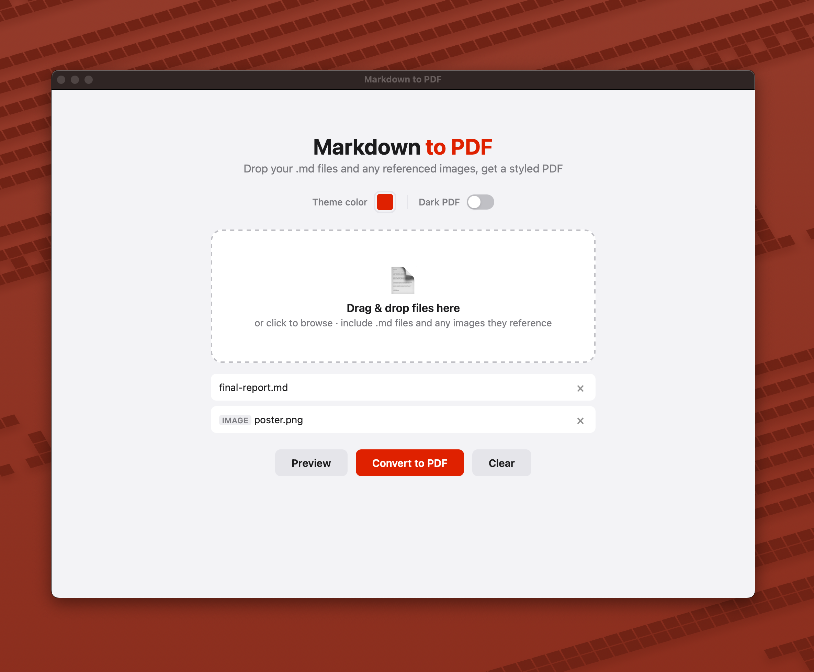

# Styled PDFs from your Markdown



A simple drag-and-drop tool that converts markdown files to professionally styled PDFs. Built with Bun and compiles to a single standalone executable. Opens in a native desktop window — no browser needed.

## Features

- Drag-and-drop `.md` and image files (or click to browse)
- **Native desktop window** — opens automatically, no browser required
- Professional report-style PDF output with styled headings, code blocks, tables, blockquotes, and lists
- `.mp4` / `.webm` / `.mov` video links rendered as styled clickable cards
- Images embedded in the PDF
- Footnote support
- Multiple files combined into a single PDF
- Page numbers in the footer
- Headless mode for web hosting (`--headless`)
- Compiles to a **standalone executable** — no runtime dependencies

## Requirements

- [Bun](https://bun.sh) (for development and building)
- Google Chrome, Chromium, Edge, or Brave installed on the system (used for PDF rendering)

## Quick Start

```bash
# Install dependencies
bun install

# Start with native window
bun run dev

# Or start in headless mode (server only, no window)
bun run dev:headless
```

## Build Standalone Executable

```bash
bun run build
```

This produces a `./markdown-to-pdf` binary. Run it from anywhere:

```bash
# Opens a native desktop window
./markdown-to-pdf

# Or run headless for web hosting
./markdown-to-pdf --headless
```

## How It Works

1. You drop `.md` and image files onto the web UI
2. The server parses markdown with [markdown-it](https://github.com/markdown-it/markdown-it)
3. The parsed HTML is wrapped with a professional CSS theme
4. A headless Chrome instance (via Chrome DevTools Protocol) renders the HTML to PDF
5. The PDF is returned as a download

No Puppeteer or Playwright — a minimal CDP client (~150 lines) talks directly to Chrome over WebSocket, which avoids known `bun build --compile` bundling issues with those libraries.

The native window uses [webview-bun](https://github.com/tr1ckydev/webview-bun), which leverages the OS's built-in webview (WebKit on macOS, WebView2 on Windows, GTK/WebKit on Linux). If the native window can't open, the app falls back to printing the localhost URL.

## Configuration

| Environment Variable | Default | Description |
|---------------------|---------|-------------|
| `PORT` | `3000` | Server port |
| `CHROME_PATH` | auto-detected | Path to Chrome/Chromium binary |

| CLI Flag | Description |
|----------|-------------|
| `--headless` | Run without a native window (server only) |
